# **Descripción breve del software LTI**
**LTI (Linked Talent Intelligence)** es una plataforma de reclutamiento inteligente que conecta talento y empresa de forma más humana, ágil y transparente. Su objetivo es transformar la experiencia de selección tanto para las personas candidatas como para los equipos de contratación, eliminando fricciones, tareas repetitivas y la sensación de “proceso opaco”.
**En resumen:**  
LTI no es solo un ATS más, sino una **plataforma de inteligencia de talento** que combina eficiencia tecnológica con empatía humana. Reduce costes, mejora la imagen de la empresa y acelera la toma de decisiones sin perder el toque humano que define a una gran organización.

## 🧭 **Valor Añadido Principal**
LTI aporta **claridad, automatización y conexión humana** en todo el proceso de contratación.  
Su gran diferencial es que **trata al candidato como un cliente**, ofreciendo información en tiempo real sobre el estado de su candidatura y permitiendo a los equipos de selección centrarse en lo que realmente importa: **elegir y atraer el mejor talento**.

## 💎 **Ventajas Competitivas**

- **Transparencia total:** los candidatos pueden seguir su proceso en un portal en tiempo real, reduciendo la frustración y mejorando la reputación de la marca empleadora.  
- **Automatización inteligente:** el sistema programa entrevistas, analiza currículums y sincroniza datos sin intervención manual.  
- **Colaboración sencilla:** los managers y reclutadores trabajan juntos desde una misma interfaz, dejando comentarios y puntuaciones fácilmente.  
- **Integración fluida:** se conecta con los sistemas de recursos humanos ya existentes (como nóminas o gestión interna), evitando duplicar tareas.  
- **Análisis predictivo:** detecta cuellos de botella en los procesos y propone mejoras basadas en datos.

# ⚙️ **Funciones Principales**

- **Panel unificado de selección:** centraliza todas las vacantes, candidatos y estados del proceso.  
- **Asistente virtual para candidatos:** chatbot que responde dudas y actualiza el progreso de su postulación.  
- **Agenda automática:** coordina entrevistas y recordatorios de manera autónoma.  
- **Evaluaciones colaborativas:** permite a los equipos valorar candidatos con plantillas y puntuaciones comunes.  
- **Analítica visual:** muestra indicadores clave como tiempos de contratación, abandono o satisfacción del candidato.  

---

# **Diagrama Lean Canvas** para entender el modelo de negocio.  

| Bloque | Qué representa | Preguntas clave | Tu análisis |
|---------|----------------|-----------------|--------------|
| **1. Problema** | Los tres principales problemas del cliente objetivo. | ¿Qué dolores reales tienen los clientes? ¿Cómo lo resuelven hoy? | - **“Agujero negro” de comunicación al candidato**, que daña la marca empleadora y eleva la tasa de abandono. **Hoy**: emails genéricos o silencio.   - **Sobrecarga administrativa y procesos manuales** (programación de entrevistas, doble entrada en HRIS/Payroll). **Hoy**: planillas, correo y tareas repetitivas.   - **Analítica débil y retrospectiva** que no identifica cuellos de botella ni mejora decisiones. **Hoy**: dashboards estáticos.   > _Fuente: Documento ATS, secciones 2.1, 3.1, 3.2._ |
| **2. Segmento de clientes** | Los tipos de clientes a los que te diriges. | ¿Quién tiene este problema? ¿Qué características los definen? | - **Departamentos de RRHH y TA** en **mid-market y enterprise** con múltiples stakeholders (reclutador, hiring manager, candidato) y HRIS ya implantado. _(hipótesis inferida)_   - **Equipos con alta rotación o hiring acelerado** (p. ej., ingeniería, atención al cliente) donde la **velocidad** y la **colaboración** son críticas.   - **Organizaciones reguladas (GDPR/EEOC)** que requieren trazabilidad, auditoría y reducción de sesgos.   > _Fuente: Documento ATS, secciones 1.1, 3.3, 4.1–4.2._ |
| **3. Propuesta de valor única (UVP)** | La promesa central que diferencia tu producto. | ¿Por qué tu solución es especial o mejor que las alternativas? | - **“Nexus”: Intelligent Hiring Workspace** que **automatiza** el 90% de lo administrativo (RPA+IA), **colabora en tiempo real** (manager-first, @menciones, scorecards) y **trata al candidato como cliente** (portal en tiempo real + chatbot).   - **Foso**: UX de colaboración para managers, **IA híbrida** (semántica + generativa) y **integración bidireccional HRIS** “cero-entrada-manual”.   > _Fuente: Documento ATS, secciones 5.1–5.3._ |
| **4. Solución** | Cómo resuelves el problema. | ¿Qué características o servicios ofrece tu producto? | - **CX**: Portal de estatus en tiempo real, chatbot 24/7, notificaciones automáticas.   - **Eficiencia**: Programador inteligente de entrevistas (RPA), **sincronización HRIS** 2-vías, **parser semántico** con verificación por el candidato.   - **Colaboración y analítica**: Perfiles como hilos, @menciones, scorecards, **dashboard predictivo** de cuellos de botella; **GenAI** para JDs, outreach y resúmenes.   > _Fuente: Documento ATS, secciones 2.1–2.2, 3.1–3.2, 4.1–4.2, 5.4._ |
| **5. Canales** | Cómo llegarás a tus clientes. | ¿Cómo descubrirán, probarán y comprarán tu producto? | - **Ventas B2B con product-led demo** (POC del dashboard predictivo y del “one-click” HRIS). _(hipótesis inferida)_   - **Parcerias y marketplaces** con HRIS/Payroll y consultoras de selección; **contenido** (casos de uso CX, eficiencia, compliance). _(hipótesis inferida)_   - **Eventos/webinars** centrados en “manager-first collaboration” y **reducción del time-to-hire**. _(hipótesis inferida)_   > _Fuente: Documento ATS, énfasis en integración HRIS y colaboración como propuesta demostrable (5.1–5.4)._ |
| **6. Fuentes de ingresos** | De dónde viene el dinero. | ¿Cómo y cuánto te pagarán los clientes? | - **SaaS por suscripción** (por número de asientos de reclutadores/managers o por tamaño de plantilla) con **planes**: Core (ATS + CX), Pro (RPA + Analítica), Enterprise (Integraciones 2-vías, Compliance avanzado). _(hipótesis inferida)_   - **Add-ons**: Parser semántico premium, módulos de IA generativa, implementación e integraciones personalizadas. _(hipótesis inferida)_   > _Fuente: Documento ATS, valor central en automatización/IA e integración profunda que justifican pricing por valor (5.2–5.3, 5.4)._ |
| **7. Estructura de costes** | Los costes principales del modelo. | ¿Qué gastos son necesarios para operar el negocio? | - **I+D de IA y RPA**, mantenimiento de **APIs e integraciones HRIS/Payroll**, **infraestructura cloud** y seguridad/compliance (GDPR, auditoría).   - **Producto/UX móvil-primero**, soporte e implantación; **ventas y marketing B2B**. _(hipótesis inferida)_   > _Fuente: Documento ATS, requisitos de motor IA/RPA, UX manager-first e integración 2-vías (3.1, 3.3, 4.1, 5.3–5.4)._ |
| **8. Métricas clave** | Indicadores de progreso. | ¿Qué medirás para saber si tu modelo funciona? | - **Time-to-Hire / Time-to-Fill**, **drop-off por etapa**, **% tareas automatizadas**, **errores de sincronización HRIS** y **adopción de managers** (uso móvil, scorecards completados).   - **NPS del candidato**, **SLA de comunicación** (tiempo a respuesta/estatus), **cuellos de botella resueltos** y **ROI por fuente**.   > _Fuente: Documento ATS, sección 3.2 (métricas y diagnóstico) y 2.1–2.2 (CX)._ |
| **9. Ventaja injusta** | Lo que no puede copiar la competencia. | ¿Qué tienes tú que nadie más puede replicar fácilmente? | - **UX de colaboración “manager-first”** que centraliza el 100% del feedback en el perfil-hilo y eleva la adopción real.   - **Motor IA híbrido** (screening semántico + GenAI de contenido) y **ecosistema “cero-entrada-manual”** con **integración HRIS bidireccional**.   > _Fuente: Documento ATS, secciones 5.1–5.3 y 4.1–4.2._ |

# **Descripción de los 3 casos de uso principales**
### Caso de uso 1: Portal de Candidato en Tiempo Real

- **Descripción:**  
  El candidato puede seguir el estado de su proceso de selección en tiempo real mediante un portal de autoservicio. Este acceso directo le muestra fases claras como “Aplicación recibida”, “En revisión por manager”, “Entrevista programada” o “Puesto cubierto”. Además, integra un chatbot de IA 24/7 que responde preguntas frecuentes y comunica actualizaciones automáticas, eliminando la sensación de “agujero negro” que caracteriza a los ATS tradicionales.  

- **Actores principales:**  
  Candidato (usuario final), sistema ATS (módulo CX), chatbot IA, reclutador (emisor de actualizaciones).  

- **Flujo principal:**  
  1. El candidato inicia sesión en su portal.  
  2. El sistema consulta su estatus actual en el embudo.  
  3. El chatbot ofrece actualizaciones o respuestas automáticas.  
  4. Al cambiar de etapa, el sistema envía notificaciones automáticas personalizadas.  

- **Problema que resuelve:**  
  Falta de transparencia y comunicación proactiva durante el proceso de selección (“ATS Black Hole”).  

- **Valor principal para el usuario:**  
  Confianza, visibilidad y reducción de la ansiedad durante la espera; mejora de la marca empleadora.  

- **Métricas o señales de validación:**  
  Reducción del 60% en consultas manuales al equipo de RRHH; incremento en la tasa de finalización de solicitudes y NPS del candidato.  
---

### Caso de uso 2: Programador de Entrevistas Inteligente y Sincronización HRIS “Zero-Manual-Entry”

- **Descripción:**  
  El sistema automatiza la coordinación de entrevistas y la transferencia de datos al HRIS/Nómina. A través de RPA e integraciones API, detecta huecos comunes en los calendarios de entrevistadores, envía invitaciones y confirma citas sin intervención humana. Al contratar a un candidato, sus datos se transfieren automáticamente al sistema de RRHH, creando su perfil y activando el flujo de onboarding.  

- **Actores principales:**  
  Reclutador, manager, candidato, sistema ATS, calendarios (Google/Outlook), HRIS/Nómina.  

- **Flujo principal:**  
  1. El reclutador selecciona candidatos e interlocutores.  
  2. El sistema sincroniza calendarios y propone horarios.  
  3. El candidato confirma la cita.  
  4. Al marcar “Contratado”, los datos se transfieren automáticamente al HRIS y se inicia el onboarding.  

- **Problema que resuelve:**  
  Sobrecarga administrativa, duplicación de datos y errores humanos en la transferencia manual entre sistemas.  

- **Valor principal para el usuario:**  
  Ahorro de tiempo, eliminación de tareas repetitivas, reducción del burnout del reclutador y eficiencia operacional inmediata.  

- **Métricas o señales de validación:**  
  - Reducción del tiempo medio de programación en un 90%.  
  - Eliminación de errores de transcripción entre ATS y HRIS.  
  - Disminución de 30% en coste por contratación.  
---

### Caso de uso 3: Espacio de Trabajo Colaborativo Unificado

- **Descripción:**  
  Cada perfil de candidato se convierte en un “hilo de colaboración” donde reclutadores, managers e interlocutores pueden comentar, etiquetarse y puntuar candidatos mediante scorecards estructurados. El sistema centraliza notas, interacciones y evaluaciones en un solo lugar accesible desde escritorio o móvil. Esto sustituye correos y mensajes dispersos, acelerando las decisiones de contratación y mejorando la trazabilidad del feedback.  

- **Actores principales:**  
  Manager, reclutador, entrevistadores, sistema ATS (módulo colaborativo).  

- **Flujo principal:**  
  1. El reclutador comparte el perfil del candidato.  
  2. Los managers añaden notas y @menciones.  
  3. El sistema registra feedback en scorecards estandarizados.  
  4. Se genera una vista consolidada de interacciones y puntuaciones.  

- **Problema que resuelve:**  
  Feedback lento, asíncrono y desestructurado entre reclutadores y managers; pérdida de información en canales externos.  

- **Valor principal para el usuario:**  
  Colaboración en tiempo real, transparencia en la evaluación y adopción natural del sistema por parte de los managers.  

- **Métricas o señales de validación:**  
  - Incremento del 40% en participación de managers en el ATS.  
  - Reducción del tiempo de feedback de días a horas.  
  - Mejora del ratio de contratación por semana activa.  

## Diagrama UML de casos de uso 
Para renderizar el diagrama, he generado la sintaxis en PlantUML que se encuentra en el archivo dcu.puml. 
Luego lo he convertido a png con el comando plantuml -tpnf dcu.puml

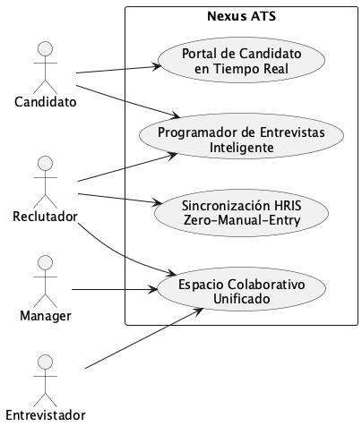

Mermaid se puede renderizar directamente, pero no soporta el diagrama de Casos de Uso. 
Lo he simulado mediante un diagrama de flujo.

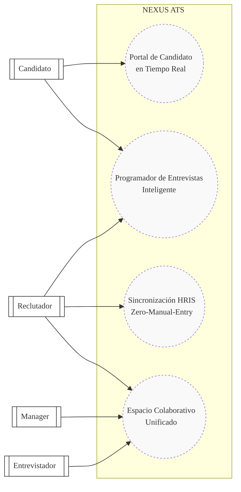

# **Modelo de datos (diagrama EER)** que cubra entidades, atributos (nombre y tipo) y relaciones.  
## EER (Minimal Executive View)

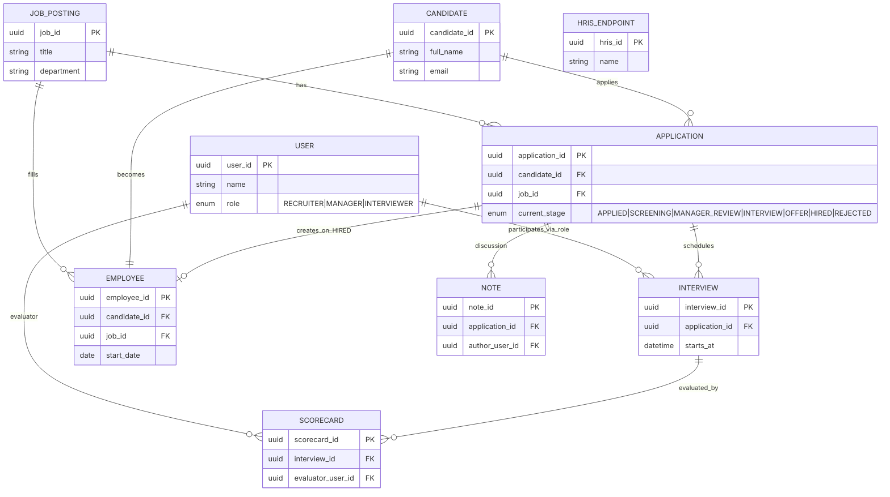

## Versión ampliada completa
```mermaid
%%{init: {"theme":"default","themeVariables":{"fontFamily":"Inter, Arial"}}}%%
erDiagram

  USER {
    uuid user_id PK
    string name
    string email
    enum role        "RECRUITER|MANAGER|INTERVIEWER"
    boolean is_active
    datetime created_at
    datetime updated_at
  }

  CANDIDATE {
    uuid candidate_id PK
    string full_name
    string email
    string phone
    string location
    string resume_url
    datetime created_at
    datetime updated_at
  }

  JOB_POSTING {
    uuid job_id PK
    string title
    string department
    string location
    enum status      "OPEN|ON_HOLD|CLOSED"
    datetime created_at
    datetime updated_at
  }

  APPLICATION {
    uuid application_id PK
    uuid candidate_id FK
    uuid job_id FK
    enum current_stage "APPLIED|SCREENING|MANAGER_REVIEW|INTERVIEW|OFFER|HIRED|REJECTED"
    string source
    datetime created_at
    datetime updated_at
  }

  APPLICATION_STATUS_HISTORY {
    uuid status_id PK
    uuid application_id FK
    enum stage       "APPLIED|SCREENING|MANAGER_REVIEW|INTERVIEW|OFFER|HIRED|REJECTED"
    uuid changed_by_user_id FK
    datetime changed_at
    text note
  }

  NOTIFICATION {
    uuid notification_id PK
    uuid application_id FK
    enum channel     "EMAIL|PORTAL|SMS"
    string template_key
    json payload
    datetime sent_at
  }

  CHATBOT_SESSION {
    uuid session_id PK
    uuid candidate_id FK
    uuid application_id FK
    datetime started_at
    datetime ended_at
  }

  CHATBOT_MESSAGE {
    uuid message_id PK
    uuid session_id FK
    enum sender      "CANDIDATE|BOT"
    text text
    datetime created_at
  }

  INTERVIEW {
    uuid interview_id PK
    uuid application_id FK
    datetime starts_at
    datetime ends_at
    string location
    enum status      "PENDING|SCHEDULED|COMPLETED|CANCELLED"
    uuid created_by FK
  }

  INTERVIEW_PARTICIPANT {
    uuid interview_id FK
    uuid user_id FK
    enum role        "INTERVIEWER|OBSERVER|HIRING_MANAGER"
    %% PK compuesta:
    %% PRIMARY KEY (interview_id, user_id)
  }

  CALENDAR_ACCOUNT {
    uuid calendar_id PK
    uuid user_id FK
    enum provider    "GOOGLE|OUTLOOK"
    string external_account
    string oauth_token_ref
  }

  HRIS_ENDPOINT {
    uuid hris_id PK
    string name
    string base_url
    string api_key_ref
    boolean is_active
  }

  HRIS_SYNC_EVENT {
    uuid sync_id PK
    uuid application_id FK
    uuid hris_id FK
    enum event_type  "CREATE_EMPLOYEE|UPDATE_EMPLOYEE|START_ONBOARDING"
    json payload_out
    enum status      "QUEUED|SENT|CONFIRMED|ERROR"
    datetime created_at
    datetime confirmed_at
    text error_message
  }

  EMPLOYEE {
    uuid employee_id PK
    uuid candidate_id FK
    uuid job_id FK
    date start_date
    uuid manager_user_id FK
    string hris_employee_key
    datetime created_at
  }

  NOTE {
    uuid note_id PK
    uuid application_id FK
    uuid author_user_id FK
    text text
    datetime created_at
  }

  MENTION {
    uuid mention_id PK
    uuid note_id FK
    uuid mentioned_user_id FK
    datetime created_at
  }

  SCORECARD_TEMPLATE {
    uuid template_id PK
    string name
    text description
    uuid created_by FK
    datetime created_at
  }

  SCORECARD_ITEM_DEF {
    uuid item_def_id PK
    uuid template_id FK
    string name
    int scale_min
    int scale_max
    decimal weight
  }

  SCORECARD {
    uuid scorecard_id PK
    uuid interview_id FK
    uuid evaluator_user_id FK
    datetime submitted_at
    text overall_comment
  }

  SCORECARD_ITEM {
    uuid scorecard_item_id PK
    uuid scorecard_id FK
    uuid item_def_id FK
    int score
    text comment
  }

  %% =========================
  %% RELATIONSHIPS (cardinalities)
  %% =========================
  CANDIDATE ||--o{ APPLICATION : "applies"
  JOB_POSTING ||--o{ APPLICATION : "has"

  APPLICATION ||--o{ APPLICATION_STATUS_HISTORY : "status history"
  APPLICATION ||--o{ NOTIFICATION : "triggers"

  CANDIDATE ||--o{ CHATBOT_SESSION : "starts"
  CHATBOT_SESSION ||--o{ CHATBOT_MESSAGE : "contains"

  APPLICATION ||--o{ INTERVIEW : "schedules"
  INTERVIEW ||--o{ INTERVIEW_PARTICIPANT : "has"
  USER ||--o{ INTERVIEW_PARTICIPANT : "participates"

  USER ||--o{ CALENDAR_ACCOUNT : "links"

  HRIS_ENDPOINT ||--o{ HRIS_SYNC_EVENT : "handles"
  APPLICATION ||--o{ HRIS_SYNC_EVENT : "emits"

  APPLICATION ||--o| EMPLOYEE : "creates on HIRED"
  CANDIDATE ||--|| EMPLOYEE : "becomes"
  JOB_POSTING ||--o{ EMPLOYEE : "fills"

  APPLICATION ||--o{ NOTE : "discussion"
  NOTE ||--o{ MENTION : "mentions"
  USER ||--o{ NOTE : "authors"
  USER ||--o{ MENTION : "is mentioned"

  SCORECARD_TEMPLATE ||--o{ SCORECARD_ITEM_DEF : "defines"
  INTERVIEW ||--o{ SCORECARD : "evaluated by"
  USER ||--o{ SCORECARD : "evaluator"
  SCORECARD ||--o{ SCORECARD_ITEM : "includes"
  SCORECARD_ITEM_DEF ||--o{ SCORECARD_ITEM : "instantiates"
```
## EER Caso de Uso 1: Portal de Candidato en Tiempo Real
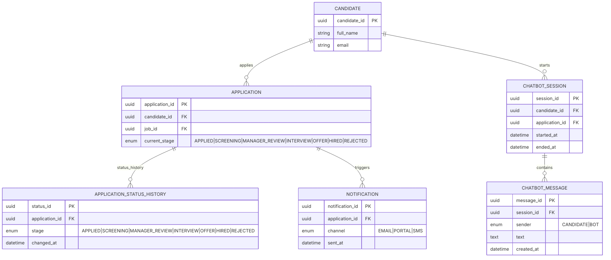

## EER Caso de Uso 2: Programador de Entrevistas Inteligente y Sincronización HRIS “Zero-Manual-Entry”
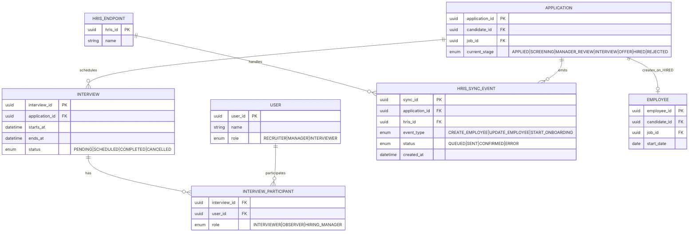

## EER Caso de Uso 3: Espacio de Trabajo Colaborativo Unificado

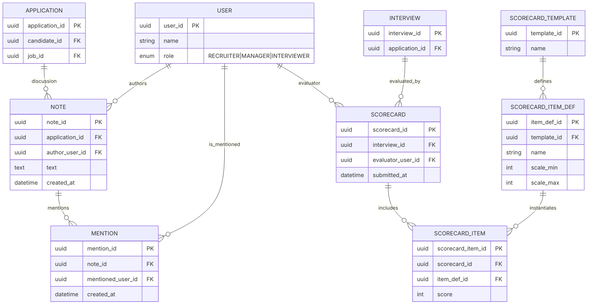

# **Diseño del sistema a alto nivel**: Diagrama de componentes de UML

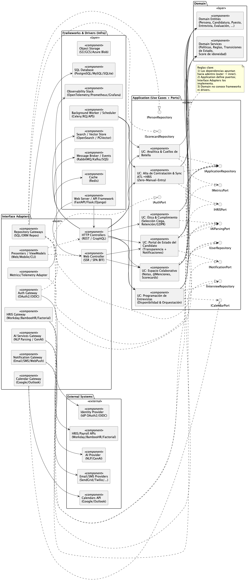

## Explicación del diagrama de componentes: Arquitectura ATL (Clean Architecture)

- **Capas concéntricas**:
  - **Domain**: entidades y servicios de dominio puros (reglas, políticas, transiciones de estado).
  - **Application (Use Cases + Ports)**: casos de uso orquestan el dominio y **definen puertos** (interfaces) para servicios externos.
  - **Interface Adapters**: controladores, presentadores y **gateways** que **implementan** los puertos y adaptan datos E/S.
  - **Frameworks & Drivers**: detalles de infraestructura (HTTP, workers, DB, cache, colas, observabilidad).

- **Regla de dependencias**: siempre **apuntan hacia adentro**.  
  *Domain* no conoce frameworks; *Application* solo depende de **interfaces**; los detalles viven fuera.

- **Puertos (salidas de Application)**:
  - `INotificationPort`, `ICalendarPort`, `IHRISPort`, `IAIParsingPort`, `IAuthPort`, `IMetricsPort`.
  - Permiten sustituir proveedores sin tocar casos de uso (inversión de dependencias).

- **Repositorios (persistencia)**: `IApplicationRepository`, `IInterviewRepository`, etc.  
  Los **gateways** en *Interface Adapters* los **implementan** y se conectan a la DB/ORM.

- **Entradas al sistema**:
  - **HTTP Controllers** (REST/GraphQL) y **Web Controller** (BFF/SSR) invocan **Use Cases**.
  - **Presenters/ViewModels** formatean salidas para web/móvil/CLI.

- **Integraciones externas**:
  - **Calendarios** (Google/Outlook), **HRIS/Payroll**, **Email/SMS**, **IdP (OAuth/OIDC)**, **AI (NLP/GenAI)**.
  - Accedidas a través de **gateways** que implementan los puertos.

- **Flujos clave del PMV**:
  - **Portal/Notificaciones** (estado en tiempo real del candidato).
  - **Programación de entrevistas** (integración de calendarios).
  - **Alta y sincronización HRIS** (*Zero-Manual-Entry*).
  - **Colaboración** (notas, @menciones, scorecards).

- **Beneficios**:
  - Aislamiento del **core** de negocio, **testabilidad** alta, **sustituibilidad** de proveedores y **evolución** sin romper reglas del dominio.

# **Diagramas C4** de Arquitectura del sistema

## C4 Contexto del Sistema (L1)

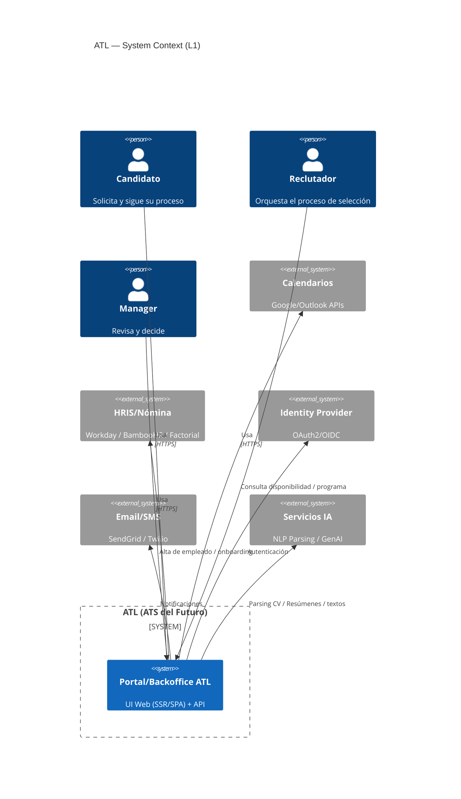
## C4 Contenedores del Sistema (L2). Este es el diagrama principal que muestra la arquitectura de alto nivel de nuestro sistema de ATL (Clean Architecture)
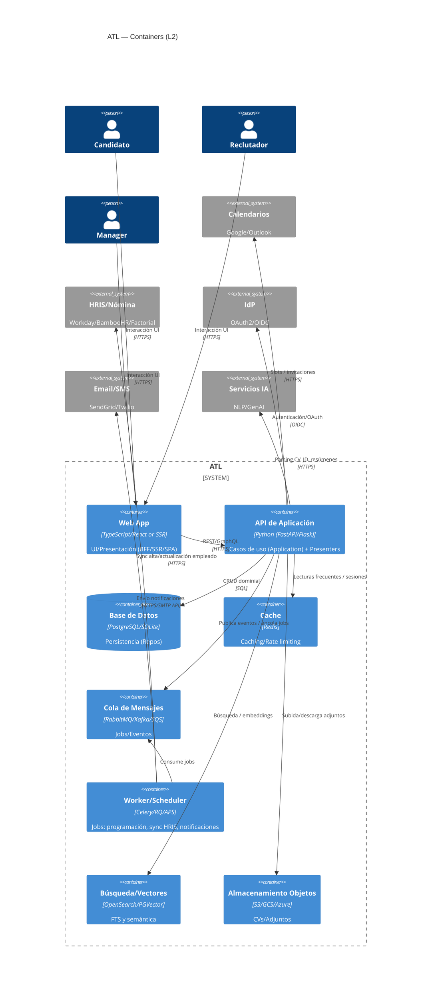

## C4 Componentes del Sistema (L3) — API de Aplicación
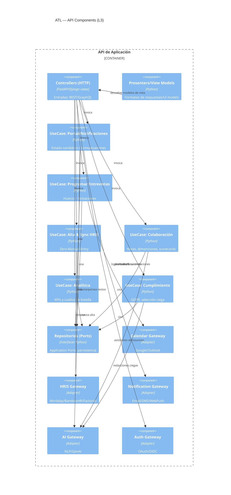

## Explicación de los diagramas (C4 + Clean Architecture)

- **L1 — Contexto**: ATL se relaciona con **personas** (candidato, reclutador, manager) y **sistemas externos** (Calendarios, HRIS, IdP, Email/SMS, IA). El **Portal/Backoffice** es el punto de entrada.

- **L2 — Contenedores**:  
  - **Web App** (UI/BFF) para interacción humana.  
  - **API de Aplicación** implementa **casos de uso** y **presenters** (Clean Architecture).  
  - **DB/Cache/Queue/Worker/Search/Blob** sostienen persistencia, rendimiento, jobs y adjuntos.  
  - Integraciones: **Calendarios**, **HRIS**, **IdP**, **Email/SMS**, **IA**.

- **L3 — Componentes (API)**: **Controllers** → **Use Cases** → **Repos/Gateways**.  
  Los **Use Cases** encapsulan reglas de aplicación y dependen de **puertos** (repos/gateways).  
  Los **adapters** (gateways) implementan integraciones externas. **Presenters** formatean la salida.

**Beneficios**: separación de capas, sustitución simple de proveedores, testabilidad alta y evolución segura del dominio.
